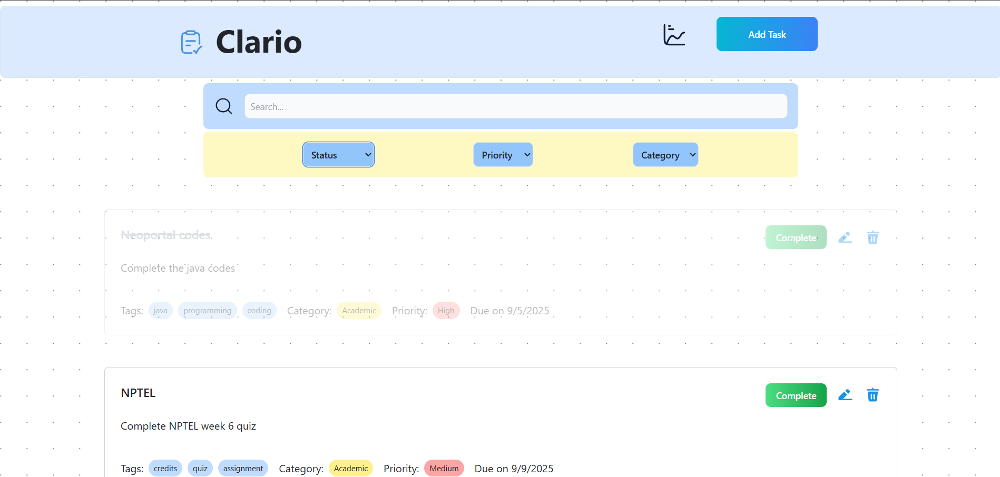
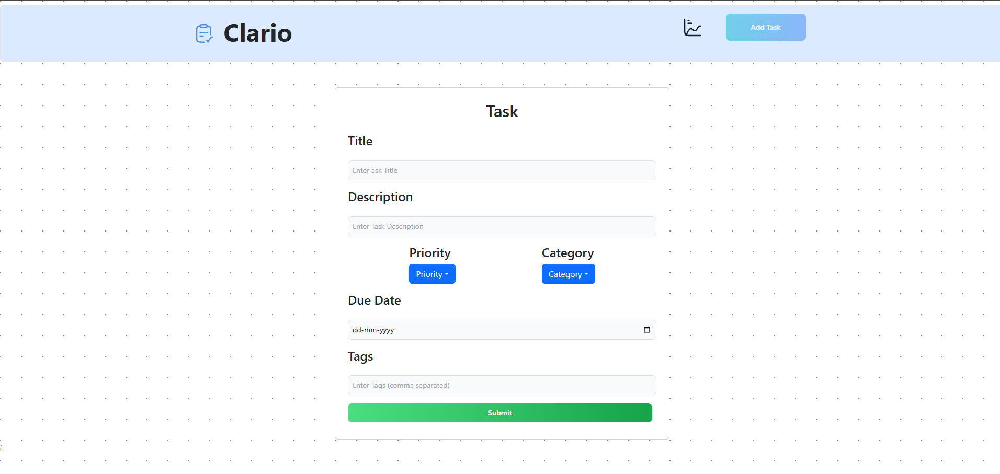
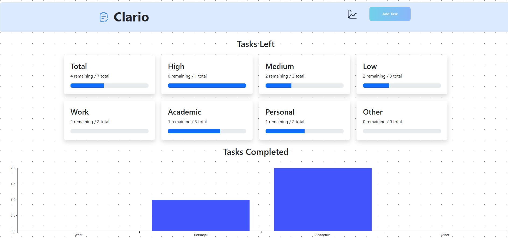

# Clario – Organize for Clarity

Clario is a modern, responsive **ToDo application** designed to help you organize your tasks efficiently. You can **create, read, update, and delete tasks**, filter them by **category, status, and priority**, and view **analytics** for completed and remaining tasks.  

---

## **Features**

- **CRUD Tasks:** Add, edit, and delete tasks easily.  
- **Filtering:** Filter tasks by **category (Academics, Work, Personal)**, **status (Completed / Pending)**, and **priority (Low, Medium, High)**.  
- **Analytics:** Quickly see how many tasks are completed and how many are pending.  
- **Responsive Design:** Works perfectly on mobile, tablet, and desktop.  
- **Clean UI:** Minimalist and user-friendly design for better productivity.  

---

## **Tech Stack**

**Frontend:**  
- React  
- Vite  
- Tailwind CSS  
- Axios  

**Backend:**  
- Node.js  
- Express.js  
- MongoDB (Mongoose)  

**Deployment:**  
- Frontend: Vercel  
- Backend: Vercel  

---

## **Screenshots**

### **Dashboard / Task List**
  

### **Add / Edit Task**
  

### **Analytics**
  

---
